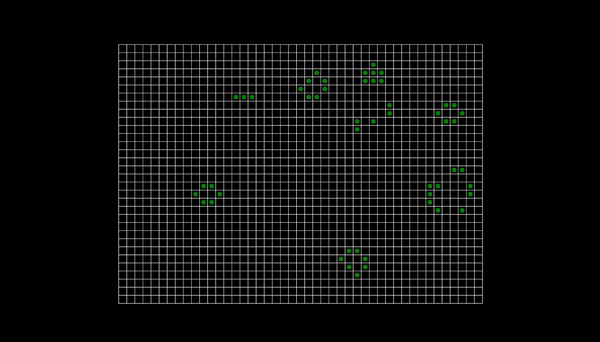

# Conway's Game of Life (p5.js)

An animated version of Conway's Game of Life in JavaScript, drawn with p5.js. The grid fills the whole browser window, on desktop and on phones.



**Live demo:** https://rishabkgautam.github.io/game-of-life-p5/

## About

I first wrote the core logic as an Exercism exercise, then ported it to JavaScript and added a p5.js front end to animate it. Living cells are drawn as green dots on a white grid. The grid size adapts to the screen, with about 32 cells along the shorter side of the window and as many rows and columns as fit along the longer side.

Build notes: [how I went from an Exercism exercise to this simulation](NOTES.md)

## The rules

Each cell is either alive or dead and looks at its eight neighbours:

1. A live cell with fewer than two live neighbours dies (underpopulation).
2. A live cell with two or three live neighbours survives.
3. A live cell with more than three live neighbours dies (overpopulation).
4. A dead cell with exactly three live neighbours becomes alive (reproduction).

From these rules you get still lifes (blocks, beehives), oscillators, and moving patterns like gliders.

## How it works

- The board starts randomly, with each cell having a 10% chance of being alive.
- Each frame draws the current generation, then computes the next one from it into a separate matrix, so cells never see half-updated neighbours.
- The simulation runs at 10 frames per second.
- Cells outside the grid count as dead, so the edges are not wrapped around.
- The layout is calculated from the window size. When you resize the window, the grid is redrawn to fit, and the board is only reset if the number of rows or columns changes.
- Refresh the page to start again from a new random board.

## Run it locally

No install or build step is needed.

```
git clone https://github.com/rishabkgautam/game-of-life-p5.git
cd game-of-life-p5
```

Then open `index.html` in a browser. p5.js is loaded from a CDN, so you need an internet connection.

## Customising

Everything lives in `sketch.js`:

- Grid density: change `cellsOnShortSide` (a bigger number gives smaller cells and more of them)
- Living-cell color: change the `stroke('green')` line in the "living cells" section of `draw()`
- Starting density: change the `livingProbability` default in `createRandomGrid`
- Speed: change the number passed to `frameRate()` in `setup`

## Project structure

```
index.html   page setup, loads p5.js and the sketch
sketch.js    Game of Life logic and p5.js drawing code
assets/      demo GIF used in this README
```

## Planned features

- Click to toggle cells and draw your own patterns
- Pause, step, and reset controls

## Credits

Based on the cellular automaton devised by John Horton Conway. The core logic was first written for the Exercism [Conway's Game of Life exercise](https://github.com/rishabkgautam/legendary-fiesta/tree/main/solutions/python/game-of-life/1).

## License

[MIT](./LICENSE)
